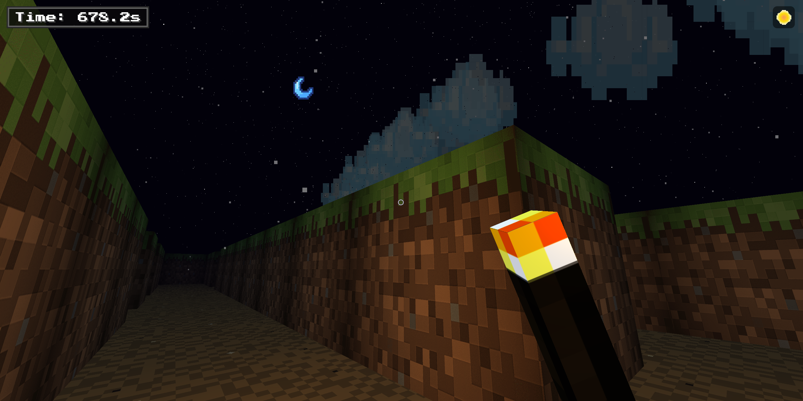

🧱 Mazecraft 3D 脱出 🧱
An immersive 3D maze game with procedurally generated levels and a beautifully synchronized day/night cycle, all wrapped in a classic blocky aesthetic.

✨ Core Features
🌌 Infinite Mazes: Dive into a new, complex maze every time you play, procedurally generated using Prim's Algorithm. No two runs are ever the same!

🕹️ Immersive 3D World: A complete first-person experience built with Three.js, featuring slick PointerLockControls for intuitive mouse and keyboard movement.

☀️ Dynamic Day/Night Cycle: The world transitions through a beautifully timed cycle with distinct sunrise, day, sunset, twilight, and night phases. The sky, lighting, and celestial bodies are all perfectly synchronized.

⛈️ Atmospheric Effects:

Continuous Rainfall: Experience natural, non-repeating rain with randomized drop speeds at night.

Celestial Arc: Watch the sun and moon traverse the sky on opposite paths.

Ambient Audio: Listen to cricket sounds that fade in as night falls, and footstep sounds as you run.

🏃 Real-time Physics: A lightweight physics engine handles gravity, jumping, and robust collision detection against maze walls.

🔦 Interactive Player: Toggle a handheld torch with a dynamic point light to illuminate your path through the darkness.

🛠️ How to Play
Clone or download this repository.

This project must be run from a local web server due to browser security policies (CORS).

With Python: python -m http.server

With Node.js: Install serve globally (npm install -g serve) and then run serve.

Open your browser to the local address (e.g., http://localhost:8000).

Click the screen to lock your cursor and begin your escape!

Controls
Key

Action

W, A, S, D

Move Forward / Left / Backward / Right

Mouse

Look Around

Spacebar

Jump

T

Toggle Torch (at night)

Sun/Moon Icon

Fast-forward to the next day/night phase

Escape

Pause and unlock the cursor

🏗️ Project Structure
For simplicity and portability, the entire game is a self-contained monolith within index.html and main.js. The code is organized into logical sections:

Configuration: All key game variables (maze size, player speed, colors) are centralized at the top for easy tuning.

Core Logic: Handles Three.js scene setup, asset loading, and the main animation loop.

Procedural Generation: Contains the Prim's Algorithm logic for creating the maze data structure.

World & Environment: Manages the creation and dynamic updates for the day/night cycle, sky, lighting, and weather.

Player & Physics: Manages player controls, movement physics, collision detection, and interactions.

Dependencies
Three.js
